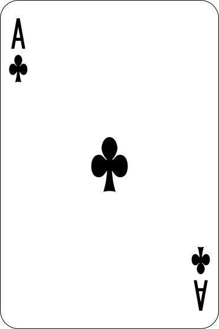
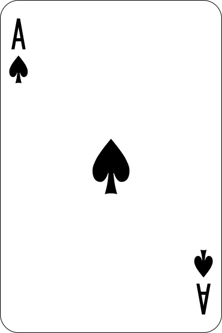
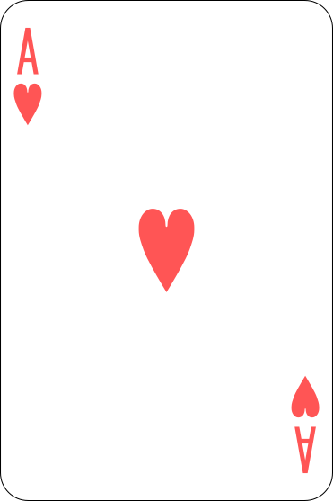
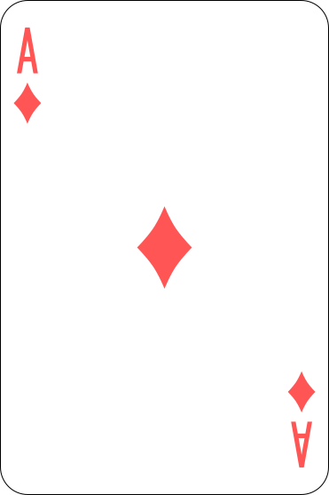

# Black Jack

## Dependencies
This game depends on `tkinter` and `pillow`. In order to run it, either double click _main.py_ from a file explorer (you might have to set it to run with Python), or run `./main.py` from a shell.

## Project Organization
### Overview
We started the project by following the given instructions up to the end of Part B. However, after starting Part C and the following, we made significant changes to the rules in order to better follow the standard Blackjack rules. To organize our code share and workflow, we used tools such as git and GitHub. The project has its own repository at the following url : [here](https://github.com/TheyCallMeHacked/BlackJack-INF131)
Moreover we made two versions of the game : a CLI one, which plays inside the shell and which can be started with the `--no-gui` command line argument, and one with a GUI made with `tkinter`.

### File organisation
The project code is divided in nine files, which contain each a given portion of how the game plays out.
1. deck.py handles the deck intialization and cards values (Part A1)
2. players.py handles the players, humans as well as bots, behaviour (Parts A2 and B)
3. croupier.py contains the specific functions for the croupier behaviour (Part C1 and C2)
4. game_management.py handles the round logic. (Part B2-B4 and C3-C4)
5. gui.py handles the gui logic and display. (Part D)
6. main.py handles the main game loop and displays end statistics for the players.
Additionally, there are three files that handle the CLI version : _croupier_no_gui.py_, game_management_nogui.py, and player_no_gui.py.

## Development process
### Rules

In order to more closely follow commonly played blackjack, we decided to use
standard casino rules. This means our ruleset is the following :
* At the beginning of the game, and after having set an initial bet, each player
gets two cards drawn. If their scores (which will be explained below) reaches
exactly 21 – they have a “blackjack” – and the game stops.
* If no player has a blackjack, the croupier draws two cards, one of which is
turned back-up (called a down card).
* After that the player has three options : hit, stand or double down.
  - Hit : the player gets another card drawn
  - Stand : the player gets no more card drawn and freezes their score
  - Double Down : if the player can, their bet is doubled and they get another
card drawn
* If a player’s score surpasses 21 (aka they “busted”), the player automatically
loses.
* Scores are calculated as follows : the rank of each card is added; court cards
have a value of ten, and for aces, their value is 21 as long as the total score is
below 21 (“soft ace”), 1 otherwise (“hard ace”).
* Finally, when all players either stand or have lost, the croupier shows his down
card and draws card until they reach or surpass a “hard seventeen”.
There are two win conditions : either if the croupier busts, or if the player’s
score surpasses the croupier’s.

### Implementations
#### Cards deck

  Instead of the recommended “rank of suit” format, we preferred to have a
shorter format including only the rank’s abbreviation preceded by the suit’s symbol
(eg. “♣2” or “♡K”). All cards are generated once by combining each suit with each
card using two nested for-loops.
  The card’s value is calculated by stripping the suit from the card, handling the
ranks that have letters as abbreviation, and finally handling the pip cards.
  The stack is initialised using as many decks as there are players (max 5) that are
shuffled using the random module.
  `drawCard` checks if the stack is all used up, reinitialises it as needed, and pops as
many cards as needed from it.
  
  
 #### Players and scores
  
  Because of an initial misunderstanding of the instructions, we initially created a
single dictionary containing all players, themselves being dictionaries containing all
thier associated data. After some thought, we realised that this had the advantage
of needing to only worry about one object instead of six, at the expense of memory.
  As we considered the advantage to outweigh the cost, we decided to keep this data
structure.
  Therefore, `initPlayers` generates this player dictionnary by associating each
name prompted for to the user (the key) to a dictionnary, itself initialised with the
default values.
`initScores` was scrapped as it was already a part of initPlayers.
  We created a funtion `calcScore` in _deck.py_ that returns a hand’s score, taking
into account hard and soft aces.
  `firstTurn` draws two cards for each player, calculates the associated score and
flags if there is a blackjack.
  `winner` compares each score with the croupier’s to determine which players won,
if any.
  
#### Player's turn
  
  `continue` has been renamed to `playerAction` because `continue` is already a
Python keyword. Additionally, the function adapts depending on the ability of
the current player to double down, to prompt them for the available actions.
  `playerTurn` gets the player’s action (notifying to `playerAction` if the player
can double down) and draws a card if required and updates the player’s score.
Instead of removing players from the dictionary, `playerTurns` unsets the player’s
`stillPlaying` flag.
  
#### A complete game
  
  `gameTurn` loops over all the players that have the `stillPlaying` flag set to run
the player turn.
  `gameOver` checks if all the players have `stillPlaying` set, and returns True if so.
`completeGame` is implemented as descirbed in the instructions.
  `completeGame` is implemented as descirbed in the instructions.
  
#### Main program
  
  _main.py_ follows the classic if __name__ == “__main__” format.
  `main` prompts for and initialises the required variables, before calling `completeGame`
in a while-loop the break condition of which is prompted to the player, asking if they
want to replay.
  
#### Bets
  
  Bets are integrated into `initPlayers`. It is an array in order to be able to modify
it from `playerAction`.
  
#### The croupier
  
  In order to more closely follow the standard blackjack rules, the croupier was not
coded to play like a normal player, but instead to play at the end of the game.
  They still draw the up and down card at the beginning in their own `firstTurn`.
  The croupier’s equivalent of `gameTurn` is play, which shows the down card and
draws until they reach a hard seventeen.
  
#### The other players
  
  The automated players have been added in the no-gui branch of the git repository, in
order to not disturb the GUI development.
  Automated and non-automated players are separated by a Human or Bot flag.
  The bots’ risk aversion is roughly proportionnal to their “playfullness” percentage.
  So the given strategies are more or less followed.
  
  #### The GUI
  
  To generate a GUI, we used `Tcl/Tk` through the `tkinter` module. The `generateGUI`
function creates a Tk instance that is set up to have labels for player information,
a canvas as the casino table, and buttons for the player actions.
  Because of the interrupt based nature of `Tcl/Tk`, the program needs multithread-
ing to have neither the GUI, nor the game halted. The GUI runs on the main thread,
and main creates a parallel daemon thread for the game logic, that is killed when
the main window is closed.
  For player input, we used dialog windows with a textual input, always called `dlg`
(short for dialog).
  When the _--no-gui_ command line argument is set, _main.py_ imports the no-gui
versions of some files instread of the latter.
  The image files used for the GUI (included in Card Files) are imported using
pillow in order to resize them as needed.
  
   
